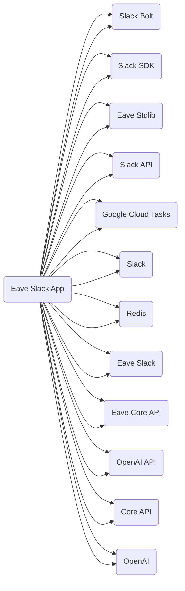

## Timestamp
2023-07-01--17:26:45

## Model
gpt-4

## Prompt
```
The following {lang} code is in a repository called "eave-monorepo", in a GitHub organization called "eave-fyi".
Does the code have any dependencies on third-party APIs or services? If so, create a short, human-readable name for each dependency, and respond with a comma-separated list of the names and nothing else. Otherwise, respond with the word "none" and nothing else.

###
Example responses:
- Slack, Google Docs, Core API, Stripe
- Confluence, Jira, Google Cloud Storage, Analytics
- Redis, Postgres, User API, Search API

###
{lang} code:

{contents}

###
List:
```

## Graph
