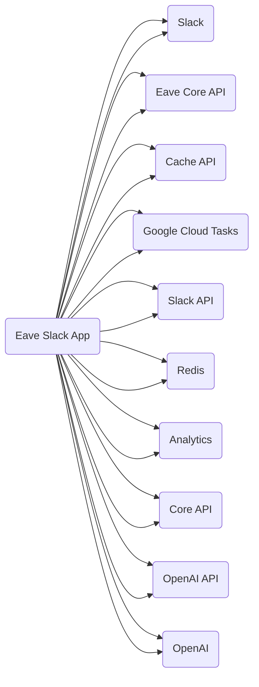

## Timestamp
2023-07-02--12:56:18

## Model
gpt-4

## Prompt
```
The following {lang} code is in a repository called "eave-monorepo", in a GitHub organization called "eave-fyi".
Scan the code and decide if it has any dependencies on external APIs or services. Then, select only the APIs and services that are likely to require HTTP requests for the integration. Then, create a short, human-readable name for each one of those dependencies. Respond with a comma-separated list of the names and nothing else. If there are no dependencies, respond with the word "none" and nothing else.

###
Example responses:
- Slack, Google Docs, Core API, Stripe
- Confluence, Jira, Google Cloud Storage, Analytics
- Redis, Postgres, User API, Search API

###
{lang} code:

{contents}

###
List:
```

## Graph
