## Timestamp
2023-07-03--14:29:30

## Model
gpt-4

## Prompt
```
You will be given a GitHub organization name, a repository name, and some code from that repository. The code will be delimited by three exclamation marks. Your task is to find the APIs and services that the code depends on, which will then be used to create a high-level system architecture diagram.

To perform this task, follow these steps:

1. Find references to well-known, common third-party services in the code. For example, there may be references to Google Cloud, AWS, Redis, Postgres, Slack API, SendGrid.

2. Find references to internal services. For example: Analytics, Core API, Authentication, Users API, GraphQL, Logging, Storage, Database.

3. Once you've gone through the code and have a better understanding of its purpose and context, go through it a few more times and adjust your list if necessary based on what you've learned.

4. Create a short, human-readable name for each service that you found.

5. Write a 1-paragraph explanation of what the service does and how it fits into the system architecture.

The code might not have any references to other systems. If you don't think there are any, don't force it.

Output your answer as a JSON array of objects, with each object containing the following keys:

- "service_name": the name that you created for the service
- "service_description": the description that you wrote for the service

Your full response should be JSON-parseable, so don't respond with something that can't be parsed by a JSON parser.
```

## Graph

```mermaid
graph LR
    eaveslackapp(Eave Slack App)
    slackbolt(Slack Bolt)
    eavestandardlibrary(Eave Standard Library)
    slackapi(Slack API)
    eavecoreapi(Eave Core API)
    eavelogging(Eave Logging)
    eavecache(Eave Cache)
    googlecloudtasks(Google Cloud Tasks)
    eaveanalytics(Eave Analytics)
    eaveutil(Eave Util)
    starlette(Starlette)
    eavestdlib(Eave stdlib)
    slackeventprocessor(Slack Event Processor)
    cache(Cache)
    eaveconfig(Eave Config)
    eaveorigin(Eave Origin)
    httpserver(HTTP Server)
    configurationmanagement(Configuration Management)
    caching(Caching)
    publickeypreloading(Public Key Preloading)
    logging(Logging)
    http(HTTP)
    eaverequests(Eave Requests)
    eaveorigins(Eave Origins)
    eavesigning(Eave Signing)
    eavetaskqueue(Eave Task Queue)
    eaveslack(Eave Slack)
    eavedocumentmanagement(Eave Document Management)
    eavesubscriptionmanagement(Eave Subscription Management)
    eaveappconfiguration(Eave App Configuration)
    eavemessage(Eave Message)
    openaiclient(OpenAI Client)
    loggingservice(Logging Service)
    exceptionhandling(Exception Handling)
    eaveslackbrain(Eave Slack Brain)
    openaiapi(OpenAI API)
    linkhandler(Link Handler)
    coreapi(Core API)
    messageprompts(Message Prompts)
    intentprocessing(Intent Processing)
    eaveslackapp-->slackbolt
    eaveslackapp-->eavestandardlibrary
    eaveslackapp-->eaveslackapp
    eaveslackapp-->slackapi
    eaveslackapp-->eavecoreapi
    eaveslackapp-->eavelogging
    eaveslackapp-->eavecache
    eaveslackapp-->googlecloudtasks
    eaveslackapp-->eaveanalytics
    eaveslackapp-->eaveutil
    eaveslackapp-->starlette
    eaveslackapp-->eavestdlib
    eaveslackapp-->slackeventprocessor
    eaveslackapp-->cache
    eaveslackapp-->eaveconfig
    eaveslackapp-->eaveorigin
    eaveslackapp-->httpserver
    eaveslackapp-->configurationmanagement
    eaveslackapp-->caching
    eaveslackapp-->publickeypreloading
    eaveslackapp-->logging
    eaveslackapp-->http
    eaveslackapp-->eaverequests
    eaveslackapp-->eaveorigins
    eaveslackapp-->eavesigning
    eaveslackapp-->eavetaskqueue
    eaveslackapp-->eaveslack
    eaveslackapp-->eavedocumentmanagement
    eaveslackapp-->eavesubscriptionmanagement
    eaveslackapp-->eaveappconfiguration
    eaveslackapp-->eavemessage
    eaveslackapp-->openaiclient
    eaveslackapp-->loggingservice
    eaveslackapp-->exceptionhandling
    eaveslackapp-->eaveslackbrain
    eaveslackapp-->openaiapi
    eaveslackapp-->linkhandler
    eaveslackapp-->coreapi
    eaveslackapp-->messageprompts
    eaveslackapp-->intentprocessing
    eaveslackapp-->slackbolt
    eaveslackapp-->eavestandardlibrary
    eaveslackapp-->eaveslackapp
    eaveslackapp-->slackapi
    eaveslackapp-->eavecoreapi
    eaveslackapp-->eavelogging
    eaveslackapp-->eavecache
    eaveslackapp-->googlecloudtasks
    eaveslackapp-->eaveanalytics
    eaveslackapp-->eaveutil
    eaveslackapp-->starlette
    eaveslackapp-->eavestdlib
    eaveslackapp-->slackeventprocessor
    eaveslackapp-->cache
    eaveslackapp-->eaveconfig
    eaveslackapp-->eaveorigin
    eaveslackapp-->httpserver
    eaveslackapp-->configurationmanagement
    eaveslackapp-->caching
    eaveslackapp-->publickeypreloading
    eaveslackapp-->logging
    eaveslackapp-->http
    eaveslackapp-->eaverequests
    eaveslackapp-->eaveorigins
    eaveslackapp-->eavesigning
    eaveslackapp-->eavetaskqueue
    eaveslackapp-->eaveslack
    eaveslackapp-->eavedocumentmanagement
    eaveslackapp-->eavesubscriptionmanagement
    eaveslackapp-->eaveappconfiguration
    eaveslackapp-->eavemessage
    eaveslackapp-->openaiclient
    eaveslackapp-->loggingservice
    eaveslackapp-->exceptionhandling
    eaveslackapp-->eaveslackbrain
    eaveslackapp-->openaiapi
    eaveslackapp-->linkhandler
    eaveslackapp-->coreapi
    eaveslackapp-->messageprompts
    eaveslackapp-->intentprocessing
```
