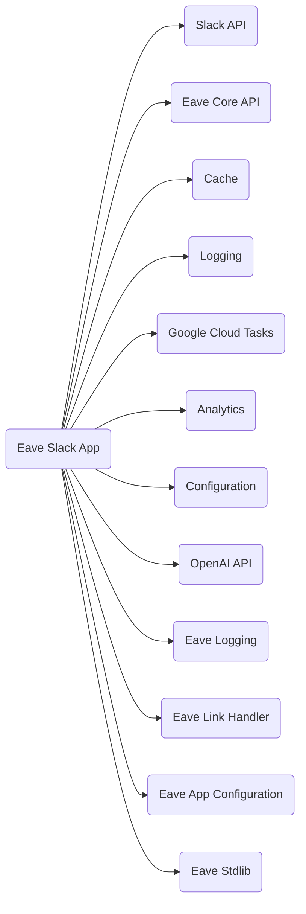

```mermaid
graph LR
    eaveslackapp(Eave Slack App)
    slackapi(Slack API)
    eavecoreapi(Eave Core API)
    cache(Cache)
    logging(Logging)
    googlecloudtasks(Google Cloud Tasks)
    analytics(Analytics)
    configuration(Configuration)
    openaiapi(OpenAI API)
    eavelogging(Eave Logging)
    eavelinkhandler(Eave Link Handler)
    eaveappconfiguration(Eave App Configuration)
    eavestdlib(Eave Stdlib)

    eaveslackapp-->slackapi

    eaveslackapp-->eavecoreapi

    eaveslackapp-->cache

    eaveslackapp-->logging

    eaveslackapp-->googlecloudtasks

    eaveslackapp-->analytics

    eaveslackapp-->configuration

    eaveslackapp-->openaiapi

    eaveslackapp-->eavelogging

    eaveslackapp-->eavelinkhandler

    eaveslackapp-->eaveappconfiguration

    eaveslackapp-->eavestdlib
```
