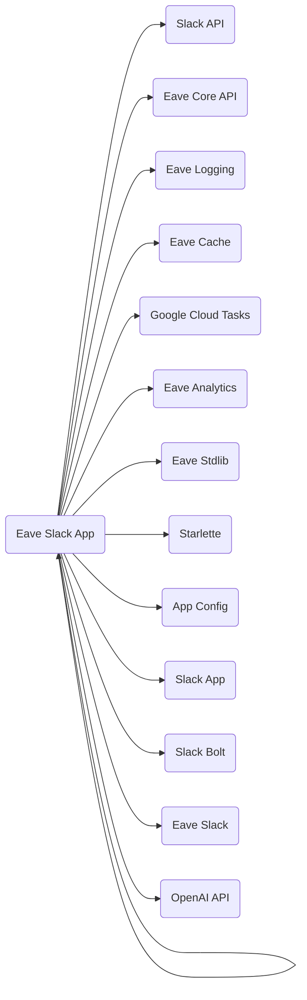

```mermaid
graph LR
    eaveslackapp(Eave Slack App)
    slackapi(Slack API)
    eavecoreapi(Eave Core API)
    eavelogging(Eave Logging)
    eavecache(Eave Cache)
    googlecloudtasks(Google Cloud Tasks)
    eaveanalytics(Eave Analytics)
    eavestdlib(Eave Stdlib)
    starlette(Starlette)
    appconfig(App Config)
    slackapp(Slack App)
    slackbolt(Slack Bolt)
    eaveslack(Eave Slack)
    openaiapi(OpenAI API)

    eaveslackapp-->slackapi

    eaveslackapp-->eavecoreapi

    eaveslackapp-->eavelogging

    eaveslackapp-->eavecache

    eaveslackapp-->googlecloudtasks

    eaveslackapp-->eaveanalytics

    eaveslackapp-->eavestdlib

    eaveslackapp-->starlette

    eaveslackapp-->eaveslackapp

    eaveslackapp-->appconfig

    eaveslackapp-->slackapp

    eaveslackapp-->slackbolt

    eaveslackapp-->eaveslack

    eaveslackapp-->openaiapi
```