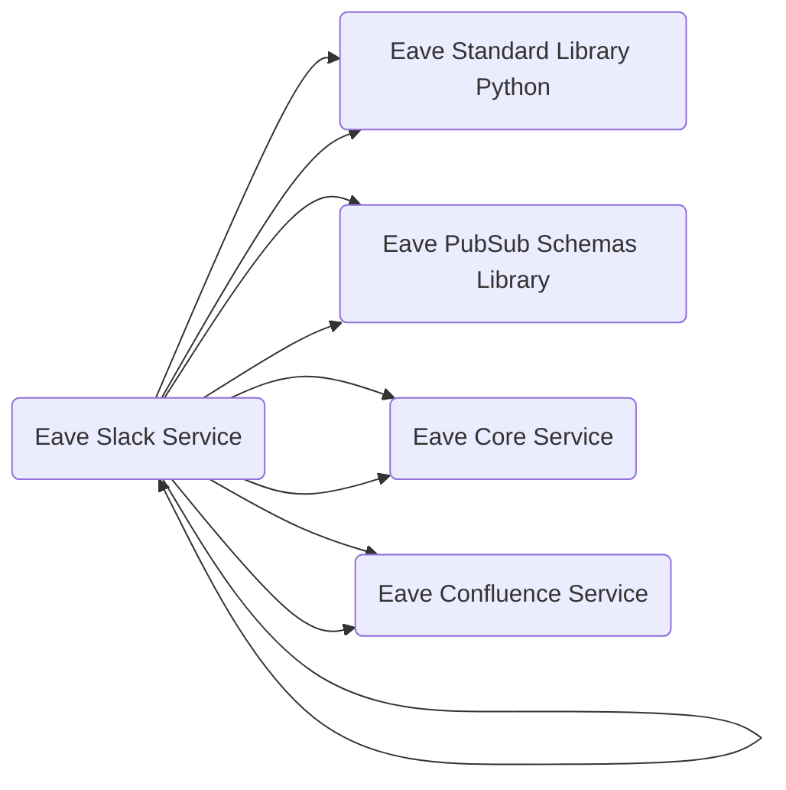

```mermaid
graph LR
    eaveslackservice(Eave Slack Service)
    eavestandardlibrarypython(Eave Standard Library Python)
    eavepubsubschemaslibrary(Eave PubSub Schemas Library)
    eavecoreservice(Eave Core Service)
    eaveconfluenceservice(Eave Confluence Service)

    eaveslackservice-->eavestandardlibrarypython

    eaveslackservice-->eavepubsubschemaslibrary
    eaveslackservice-->eavestandardlibrarypython
    eaveslackservice-->eavepubsubschemaslibrary
    eaveslackservice-->eaveslackservice

    eaveslackservice-->eavecoreservice

    eaveslackservice-->eaveconfluenceservice
    eaveslackservice-->eaveslackservice
    eaveslackservice-->eavecoreservice
    eaveslackservice-->eaveconfluenceservice
```