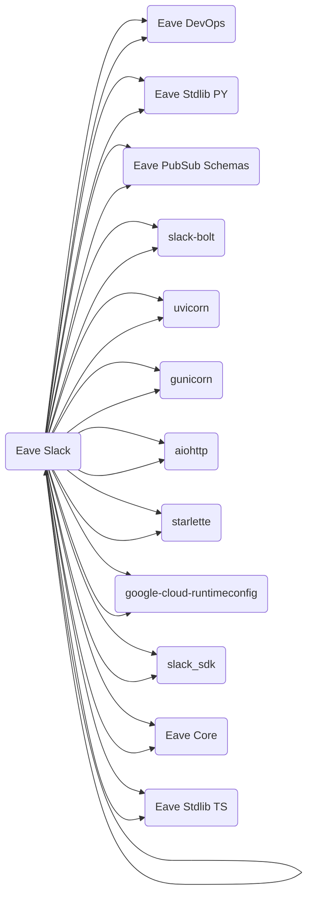

```mermaid
graph LR
    eaveslack(Eave Slack)
    eavedevops(Eave DevOps)
    eavestdlibpy(Eave Stdlib PY)
    eavepubsubschemas(Eave PubSub Schemas)
    slackbolt(slack-bolt)
    uvicorn(uvicorn)
    gunicorn(gunicorn)
    aiohttp(aiohttp)
    starlette(starlette)
    googlecloudruntimeconfig(google-cloud-runtimeconfig)
    slacksdk(slack_sdk)
    eavecore(Eave Core)
    eavestdlibts(Eave Stdlib TS)

    eaveslack-->eavedevops

    eaveslack-->eavestdlibpy

    eaveslack-->eavepubsubschemas

    eaveslack-->slackbolt

    eaveslack-->uvicorn

    eaveslack-->gunicorn

    eaveslack-->aiohttp

    eaveslack-->starlette

    eaveslack-->googlecloudruntimeconfig
    eaveslack-->eavedevops
    eaveslack-->eavestdlibpy
    eaveslack-->eavepubsubschemas
    eaveslack-->slackbolt
    eaveslack-->uvicorn
    eaveslack-->gunicorn
    eaveslack-->aiohttp
    eaveslack-->starlette
    eaveslack-->googlecloudruntimeconfig
    eaveslack-->eaveslack

    eaveslack-->slacksdk

    eaveslack-->eavecore

    eaveslack-->eavestdlibts
    eaveslack-->eaveslack
    eaveslack-->slacksdk
    eaveslack-->eavecore
    eaveslack-->eavestdlibts
```