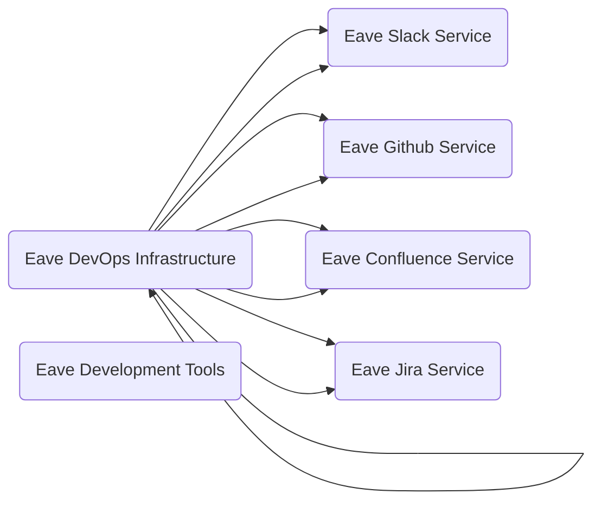

```mermaid
graph LR
    eavedevopsinfrastructure(Eave DevOps Infrastructure)
    eaveslackservice(Eave Slack Service)
    eavegithubservice(Eave Github Service)
    eaveconfluenceservice(Eave Confluence Service)
    eavejiraservice(Eave Jira Service)
    eavedevelopmenttools(Eave Development Tools)

    eavedevopsinfrastructure-->eaveslackservice

    eavedevopsinfrastructure-->eavegithubservice

    eavedevopsinfrastructure-->eaveconfluenceservice

    eavedevopsinfrastructure-->eavejiraservice
    eavedevopsinfrastructure-->eaveslackservice
    eavedevopsinfrastructure-->eavegithubservice
    eavedevopsinfrastructure-->eaveconfluenceservice
    eavedevopsinfrastructure-->eavejiraservice
    eavedevopsinfrastructure-->eavedevopsinfrastructure
    eavedevopsinfrastructure-->eavedevopsinfrastructure
```

