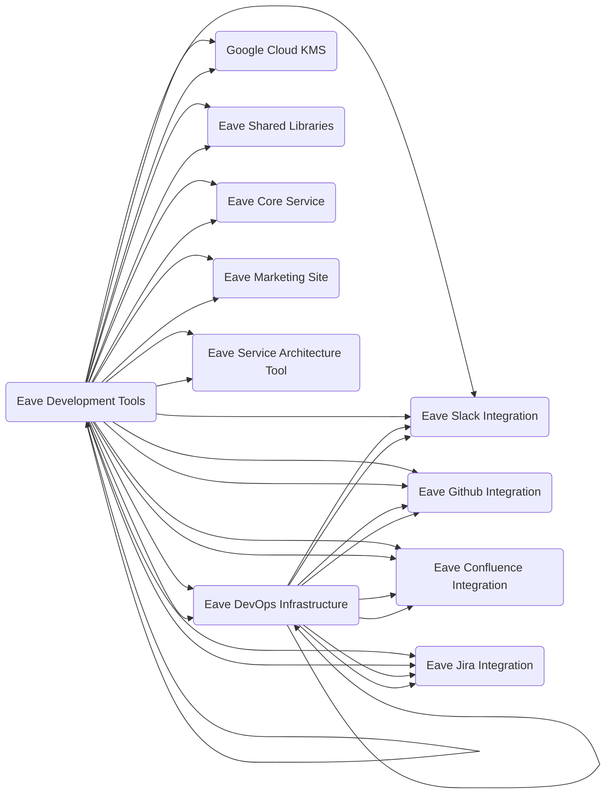

```mermaid
graph LR
    eavedevopsinfrastructure(Eave DevOps Infrastructure)
    eaveslackintegration(Eave Slack Integration)
    eavegithubintegration(Eave Github Integration)
    eaveconfluenceintegration(Eave Confluence Integration)
    eavejiraintegration(Eave Jira Integration)
    eavedevelopmenttools(Eave Development Tools)
    googlecloudkms(Google Cloud KMS)
    eavesharedlibraries(Eave Shared Libraries)
    eavecoreservice(Eave Core Service)
    eavemarketingsite(Eave Marketing Site)
    eaveservicearchitecturetool(Eave Service Architecture Tool)

    eavedevopsinfrastructure-->eaveslackintegration

    eavedevopsinfrastructure-->eavegithubintegration

    eavedevopsinfrastructure-->eaveconfluenceintegration

    eavedevopsinfrastructure-->eavejiraintegration
    eavedevopsinfrastructure-->eaveslackintegration
    eavedevopsinfrastructure-->eavegithubintegration
    eavedevopsinfrastructure-->eaveconfluenceintegration
    eavedevopsinfrastructure-->eavejiraintegration
    eavedevopsinfrastructure-->eavedevopsinfrastructure
    eavedevopsinfrastructure-->eavedevopsinfrastructure

    eavedevelopmenttools-->googlecloudkms
    eavedevelopmenttools-->eavegithubintegration
    eavedevelopmenttools-->googlecloudkms
    eavedevelopmenttools-->eavegithubintegration
    eavedevelopmenttools-->eavedevelopmenttools

    eavedevelopmenttools-->eavesharedlibraries
    eavedevelopmenttools-->eaveslackintegration
    eavedevelopmenttools-->eaveconfluenceintegration
    eavedevelopmenttools-->eavejiraintegration
    eavedevelopmenttools-->eavedevopsinfrastructure

    eavedevelopmenttools-->eavecoreservice

    eavedevelopmenttools-->eavemarketingsite

    eavedevelopmenttools-->eaveservicearchitecturetool
    eavedevelopmenttools-->eavedevelopmenttools
    eavedevelopmenttools-->eavesharedlibraries
    eavedevelopmenttools-->eaveslackintegration
    eavedevelopmenttools-->eaveconfluenceintegration
    eavedevelopmenttools-->eavejiraintegration
    eavedevelopmenttools-->eavedevopsinfrastructure
    eavedevelopmenttools-->eavecoreservice
    eavedevelopmenttools-->eavemarketingsite
    eavedevelopmenttools-->eaveservicearchitecturetool
```

