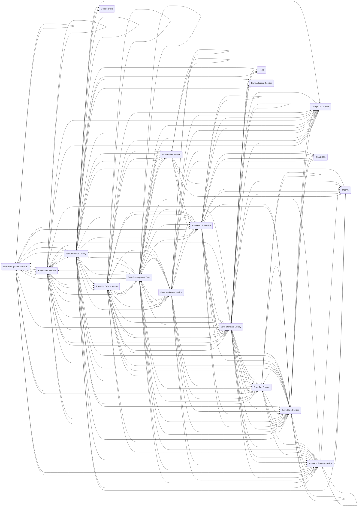

```mermaid
graph LR
    eavedevopsinfrastructure(Eave DevOps Infrastructure)
    eaveslackservice(Eave Slack Service)
    googlecloudkms(Google Cloud KMS)
    eavestandardlibrarypython(Eave Standard Library)
    eavepubsubschemas(Eave PubSub Schemas)
    eavedevelopmenttools(Eave Development Tools)
    eavegithubservice(Eave Github Service)
    eavestandardlibrarytypescript(Eave Standard Library)
    openai(OpenAI)
    eavejiraservice(Eave Jira Service)
    eavecoreservice(Eave Core Service)
    cloudsql(Cloud SQL)
    eaveconfluenceservice(Eave Confluence Service)
    redis(Redis)
    eaveatlassianservice(Eave Atlassian Service)
    eavemarketingservice(Eave Marketing Service)
    eavearcherservice(Eave Archer Service)
    googledrive(Google Drive)

    eaveslackservice-->googlecloudkms
    eavedevopsinfrastructure-->eaveslackservice
    eavestandardlibrarytypescript-->googlecloudkms
    eavepubsubschemas-->googlecloudkms
    eavepubsubschemas-->eavepubsubschemas
    eavedevelopmenttools-->googlecloudkms
    eavedevelopmenttools-->eavegithubservice
    eavedevelopmenttools-->eavedevelopmenttools
    eavedevelopmenttools-->eaveslackservice
    eaveconfluenceservice-->eavestandardlibrarytypescript
    eaveconfluenceservice-->eaveconfluenceservice
    eavejiraservice-->eavestandardlibrarytypescript
    eavejiraservice-->eavejiraservice
    eavejiraservice-->eavepubsubschemas
    eavecoreservice-->googlecloudkms

    eavecoreservice-->cloudsql
    eavestandardlibrarypython-->eavepubsubschemas
    eavestandardlibrarypython-->eavestandardlibrarypython

    eavestandardlibrarypython-->redis
    eavestandardlibrarypython-->googlecloudkms

    eavestandardlibrarypython-->openai
    eavestandardlibrarypython-->eaveslackservice
    eavestandardlibrarypython-->eavegithubservice

    eavestandardlibrarypython-->eaveatlassianservice
    eavestandardlibrarypython-->eaveconfluenceservice
    eavestandardlibrarypython-->eavejiraservice
    eavestandardlibrarypython-->eavecoreservice
    eavestandardlibrarypython-->eavedevopsinfrastructure

    eavestandardlibrarypython-->googledrive
    eavecoreservice-->eavestandardlibrarypython
    eavecoreservice-->eavepubsubschemas
    eavecoreservice-->eaveslackservice
    eavecoreservice-->eavecoreservice
    eavecoreservice-->eavegithubservice
    eavecoreservice-->eavejiraservice
    eavecoreservice-->eaveconfluenceservice
    eavejiraservice-->eavecoreservice
    eaveconfluenceservice-->eavejiraservice
    eaveconfluenceservice-->eavepubsubschemas
    eaveconfluenceservice-->eavedevelopmenttools
    eaveconfluenceservice-->openai
    eavedevelopmenttools-->eaveconfluenceservice
    eavedevelopmenttools-->eavejiraservice
    eavedevelopmenttools-->eavedevopsinfrastructure
    eavedevelopmenttools-->eavecoreservice
    eavemarketingservice-->cloudsql
    eavemarketingservice-->eavemarketingservice
    eavemarketingservice-->eavestandardlibrarypython
    eavemarketingservice-->eavepubsubschemas
    eavemarketingservice-->googlecloudkms
    eavemarketingservice-->eavedevelopmenttools
    eavemarketingservice-->eavecoreservice
    eavemarketingservice-->eaveslackservice
    eavemarketingservice-->eavegithubservice
    eavemarketingservice-->eavejiraservice
    eavemarketingservice-->eaveconfluenceservice
    eavedevelopmenttools-->eavemarketingservice
    eavearcherservice-->eavestandardlibrarypython
    eavearcherservice-->eavepubsubschemas
    eavearcherservice-->eavedevelopmenttools
    eavearcherservice-->eavearcherservice
    eavearcherservice-->eavegithubservice
    eavearcherservice-->openai
    eavedevelopmenttools-->eavearcherservice
    eavedevelopmenttools-->eavestandardlibrarypython
    eavepubsubschemas-->eavedevelopmenttools
    eavepubsubschemas-->eavestandardlibrarytypescript
    eavestandardlibrarytypescript-->eavepubsubschemas
    eavestandardlibrarytypescript-->openai
    eavestandardlibrarytypescript-->eavegithubservice
    eavestandardlibrarytypescript-->eaveslackservice
    eavestandardlibrarytypescript-->eavejiraservice
    eavestandardlibrarytypescript-->eaveconfluenceservice
    eavestandardlibrarytypescript-->eavecoreservice
    eavestandardlibrarytypescript-->eavestandardlibrarytypescript
    eavestandardlibrarytypescript-->redis
    eavestandardlibrarytypescript-->eavedevopsinfrastructure
    eavestandardlibrarytypescript-->eavedevelopmenttools
    eavestandardlibrarytypescript-->eaveatlassianservice
    eavegithubservice-->eavestandardlibrarytypescript
    eavegithubservice-->eavegithubservice
    eavegithubservice-->googlecloudkms
    eavegithubservice-->cloudsql
    eavegithubservice-->eavepubsubschemas
    eavegithubservice-->eavecoreservice
    eavegithubservice-->openai
    eavedevopsinfrastructure-->eavegithubservice
    eavedevopsinfrastructure-->eaveconfluenceservice
    eavedevopsinfrastructure-->eavejiraservice
    eavedevopsinfrastructure-->eavedevopsinfrastructure
    eaveslackservice-->eavedevopsinfrastructure
    eaveslackservice-->eavestandardlibrarypython
    eaveslackservice-->eavepubsubschemas
    eaveslackservice-->eaveslackservice
    eaveslackservice-->eavecoreservice
    eaveslackservice-->eavestandardlibrarytypescript
    eavedevopsinfrastructure-->eaveslackservice
    eavedevopsinfrastructure-->eavegithubservice
    eavedevopsinfrastructure-->eaveconfluenceservice
    eavedevopsinfrastructure-->eavejiraservice
    eavedevopsinfrastructure-->eavedevopsinfrastructure
    eavedevelopmenttools-->googlecloudkms
    eavedevelopmenttools-->eavegithubservice
    eavedevelopmenttools-->eavedevelopmenttools
    eavedevelopmenttools-->eaveslackservice
    eavedevelopmenttools-->eaveconfluenceservice
    eavedevelopmenttools-->eavejiraservice
    eavedevelopmenttools-->eavedevopsinfrastructure
    eavedevelopmenttools-->eavecoreservice
    eavedevelopmenttools-->eavemarketingservice
    eavedevelopmenttools-->eavearcherservice
    eavedevelopmenttools-->eavestandardlibrarypython
    eavecoreservice-->googlecloudkms
    eavecoreservice-->cloudsql
    eavecoreservice-->eavestandardlibrarypython
    eavecoreservice-->eavepubsubschemas
    eavecoreservice-->eaveslackservice
    eavecoreservice-->eavecoreservice
    eavecoreservice-->eavegithubservice
    eavecoreservice-->eavejiraservice
    eavecoreservice-->eaveconfluenceservice
    eaveslackservice-->googlecloudkms
    eaveslackservice-->eavedevopsinfrastructure
    eaveslackservice-->eavestandardlibrarypython
    eaveslackservice-->eavepubsubschemas
    eaveslackservice-->eaveslackservice
    eaveslackservice-->eavecoreservice
    eaveslackservice-->eavestandardlibrarytypescript
    eavejiraservice-->eavestandardlibrarytypescript
    eavejiraservice-->eavejiraservice
    eavejiraservice-->eavepubsubschemas
    eavejiraservice-->eavecoreservice
    eavegithubservice-->eavestandardlibrarytypescript
    eavegithubservice-->eavegithubservice
    eavegithubservice-->googlecloudkms
    eavegithubservice-->cloudsql
    eavegithubservice-->eavepubsubschemas
    eavegithubservice-->eavecoreservice
    eavegithubservice-->openai
    eaveconfluenceservice-->eavestandardlibrarytypescript
    eaveconfluenceservice-->eaveconfluenceservice
    eaveconfluenceservice-->eavejiraservice
    eaveconfluenceservice-->eavepubsubschemas
    eaveconfluenceservice-->eavedevelopmenttools
    eaveconfluenceservice-->openai
    eavemarketingservice-->cloudsql
    eavemarketingservice-->eavemarketingservice
    eavemarketingservice-->eavestandardlibrarypython
    eavemarketingservice-->eavepubsubschemas
    eavemarketingservice-->googlecloudkms
    eavemarketingservice-->eavedevelopmenttools
    eavemarketingservice-->eavecoreservice
    eavemarketingservice-->eaveslackservice
    eavemarketingservice-->eavegithubservice
    eavemarketingservice-->eavejiraservice
    eavemarketingservice-->eaveconfluenceservice
    eavearcherservice-->eavestandardlibrarypython
    eavearcherservice-->eavepubsubschemas
    eavearcherservice-->eavedevelopmenttools
    eavearcherservice-->eavearcherservice
    eavearcherservice-->eavegithubservice
    eavearcherservice-->openai
    eavepubsubschemas-->googlecloudkms
    eavepubsubschemas-->eavepubsubschemas
    eavepubsubschemas-->eavedevelopmenttools
    eavepubsubschemas-->eavestandardlibrarytypescript
    eavestandardlibrarytypescript-->googlecloudkms
    eavestandardlibrarytypescript-->eavepubsubschemas
    eavestandardlibrarytypescript-->openai
    eavestandardlibrarytypescript-->eavegithubservice
    eavestandardlibrarytypescript-->eaveslackservice
    eavestandardlibrarytypescript-->eavejiraservice
    eavestandardlibrarytypescript-->eaveconfluenceservice
    eavestandardlibrarytypescript-->eavecoreservice
    eavestandardlibrarytypescript-->eavestandardlibrarytypescript
    eavestandardlibrarytypescript-->redis
    eavestandardlibrarytypescript-->eavedevopsinfrastructure
    eavestandardlibrarytypescript-->eavedevelopmenttools
    eavestandardlibrarytypescript-->eaveatlassianservice
    eavestandardlibrarypython-->eavepubsubschemas
    eavestandardlibrarypython-->eavestandardlibrarypython
    eavestandardlibrarypython-->redis
    eavestandardlibrarypython-->googlecloudkms
    eavestandardlibrarypython-->openai
    eavestandardlibrarypython-->eaveslackservice
    eavestandardlibrarypython-->eavegithubservice
    eavestandardlibrarypython-->eaveatlassianservice
    eavestandardlibrarypython-->eaveconfluenceservice
    eavestandardlibrarypython-->eavejiraservice
    eavestandardlibrarypython-->eavecoreservice
    eavestandardlibrarypython-->eavedevopsinfrastructure
    eavestandardlibrarypython-->googledrive
```

