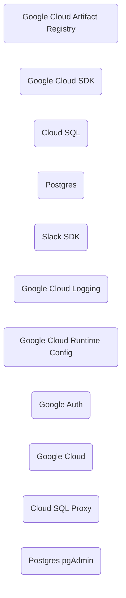

```mermaid
graph LR
    googlecloudartifactregistry(Google Cloud Artifact Registry)
    googlecloudsdk(Google Cloud SDK)
    cloudsql(Cloud SQL)
    postgres(Postgres)
    slacksdk(Slack SDK)
    googlecloudlogging(Google Cloud Logging)
    googlecloudruntimeconfig(Google Cloud Runtime Config)
    googleauth(Google Auth)
    googlecloud(Google Cloud)
    cloudsqlproxy(Cloud SQL Proxy)
    postgrespgadmin(Postgres pgAdmin)
```

