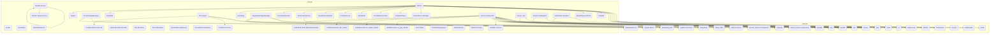

```mermaid
graph TD
    subgraph "External"
        SentrySDK(Sentry SDK)
        Docker(Docker)
        requests(requests)
        ApacheBeam(Apache Beam)
        Ratarmountcore(Ratarmountcore)
        Singularity(Singularity)
        SylabsCloudhub(Sylabs Cloud hub)
        SingularityHub(Singularity Hub)
        psutil(psutil)
        websockets(websockets)
        asyncio(asyncio)
        subprocess(subprocess)
        os(os)
        shutil(shutil)
        gzip(gzip)
        bz2(bz2)
        hashlib(hashlib)
        stat(stat)
        tempfile(tempfile)
        apache_beam.io.filesystem(apache_beam.io.filesystem)
        apache_beam.io.filesystems(apache_beam.io.filesystems)
        ratarmountcore(ratarmountcore)
        dateutil(dateutil)
        Kubernetes(Kubernetes)
    end
    subgraph "Internal"
        Codalab(Codalab)
        DependencyManager(Dependency Manager)
        WorkerMonitoring(Worker Monitoring)
        worker(worker)
        RestClient(RestClient)
        BundleService(Bundle Service)
        OAuth2TokenService(OAuth2 Token Service)
        DockerImageManager(DockerImageManager)
        TarSubdirStream(TarSubdirStream)
        ImageManager(ImageManager)
        FileSystem(File System)
        CodalabCommon(Codalab Common)
        CodalabWorkerFileUtil(Codalab Worker File Util)
        JSONEncoder/Decoder(JSON Encoder/Decoder)
        BundleInfo(BundleInfo)
        FileExtraction(File Extraction)
        RunSubsystem(Run Subsystem)
        ZipToTarDecompressor(ZipToTarDecompressor)
        SingularityImageManager(SingularityImageManager)
        FileUploadSubsystem(File Upload Subsystem)
        Worker(Worker)
        BundleServiceClient(BundleServiceClient)
        JsonStateCommitter(JsonStateCommitter)
        RunResources(RunResources)
        BundleCheckinState(BundleCheckinState)
        RunStateMachine(RunStateMachine)
        RunStage(RunStage)
        RunState(RunState)
        Reader(Reader)
        ArchiveSubsystem(Archive Subsystem)
        codalab.common(codalab.common)
        codalab.worker.un_gzip_stream(codalab.worker.un_gzip_stream)
        codalab.worker.tar_subdir_stream(codalab.worker.tar_subdir_stream)
        codalab.worker.tar_file_stream(codalab.worker.tar_file_stream)
        codalab.lib.beam.SQLiteIndexedTar(codalab.lib.beam.SQLiteIndexedTar)
        FileReader(File Reader)
        docker_utils(docker_utils)
        ThreadManagement(Thread Management)
        TarFileStream(TarFileStream)
        StateCommitter(StateCommitter)
        RuntimeSubsystem(Runtime Subsystem)
        KubernetesRuntime(Kubernetes Runtime)
    end
    WorkerMonitoring-->SentrySDK
    BundleService-->BundleService
    BundleService-->OAuth2TokenService
    DockerImageManager-->Docker
    DockerImageManager-->requests
    FileSystem-->ApacheBeam
    FileSystem-->Ratarmountcore
    FileSystem-->CodalabCommon
    FileSystem-->CodalabWorkerFileUtil
    SingularityImageManager-->Singularity
    SingularityImageManager-->Docker
    SingularityImageManager-->SylabsCloudhub
    SingularityImageManager-->SingularityHub
    Worker-->Docker
    Worker-->psutil
    Worker-->websockets
    Worker-->requests
    Worker-->asyncio
    Worker-->Codalab
    Worker-->BundleServiceClient
    Worker-->DependencyManager
    Worker-->ImageManager
    Worker-->JsonStateCommitter
    Worker-->BundleInfo
    Worker-->RunResources
    Worker-->BundleCheckinState
    Worker-->WorkerMonitoring
    Worker-->RunStateMachine
    Worker-->RunStage
    Worker-->RunState
    Worker-->Reader
    ArchiveSubsystem-->subprocess
    ArchiveSubsystem-->os
    ArchiveSubsystem-->shutil
    ArchiveSubsystem-->gzip
    ArchiveSubsystem-->bz2
    ArchiveSubsystem-->hashlib
    ArchiveSubsystem-->stat
    ArchiveSubsystem-->tempfile
    ArchiveSubsystem-->apache_beam.io.filesystem
    ArchiveSubsystem-->apache_beam.io.filesystems
    ArchiveSubsystem-->ratarmountcore
    ArchiveSubsystem-->codalab.common
    ArchiveSubsystem-->codalab.worker.un_gzip_stream
    ArchiveSubsystem-->codalab.worker.tar_subdir_stream
    ArchiveSubsystem-->codalab.worker.tar_file_stream
    ArchiveSubsystem-->codalab.lib.beam.SQLiteIndexedTar
    docker_utils-->Docker
    docker_utils-->dateutil
    RuntimeSubsystem-->Docker
    RuntimeSubsystem-->Kubernetes
    KubernetesRuntime-->Kubernetes
    KubernetesRuntime-->Docker
```